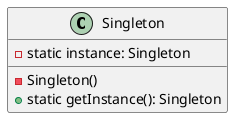
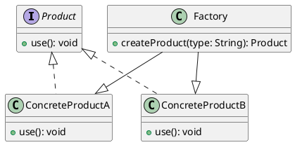
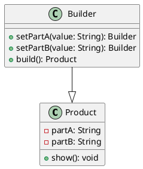
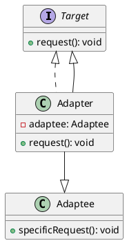
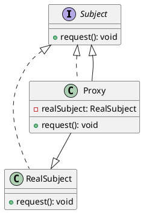
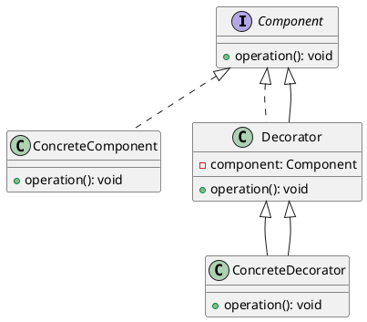
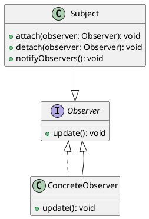
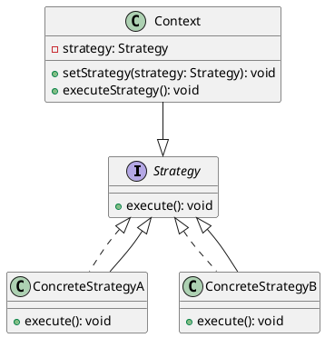
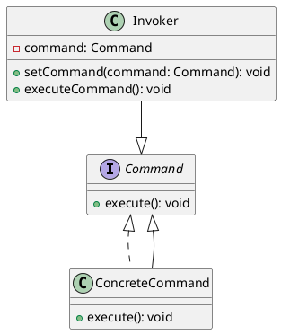
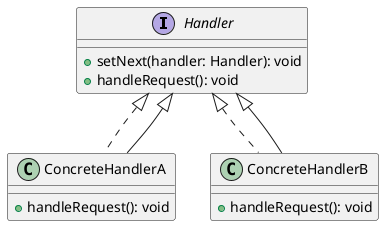

# Object-Oriented Programming (OOP) Concepts in Java

Object-Oriented Programming (OOP) is a programming paradigm that organizes code into objects. Java follows OOP principles strictly, making it one of the most popular languages for software development.

## OOP Concepts in Java

There are 6 main OOP concepts in Java:

1. **Class and Object**
2. **Encapsulation**
3. **Abstraction**
4. **Inheritance**
5. **Polymorphism**
6. **Association, Aggregation, Composition (Advanced Concepts)**

### 1. Class and Object
A **Class** is a blueprint or template that defines the structure of an object.

An **Object** is an instance of a class that holds the state (variables) and behavior (methods).

#### Syntax Example:
```java
class Student {
    String name;
    int age;

    void display() {
        System.out.println("Name: " + name);
        System.out.println("Age: " + age);
    }
}

public class Main {
    public static void main(String[] args) {
        Student s = new Student(); // Object Creation
        s.name = "Tej";
        s.age = 22;
        s.display();
    }
}
```

### 2. Encapsulation
Encapsulation means binding data (variables) and methods into a single unit (class) and hiding the internal details.

It is implemented using:
- Private variables
- Public getter and setter methods

#### Example:
```java
class Employee {
    private String name;

    public void setName(String name) {
        this.name = name;  // Using 'this' keyword
    }

    public String getName() {
        return name;
    }
}

public class Main {
    public static void main(String[] args) {
        Employee emp = new Employee();
        emp.setName("Tej");
        System.out.println(emp.getName());
    }
}
```

### 3. Abstraction
Abstraction means hiding unnecessary details and showing only the essential features of an object.

#### Types of Abstraction:
- **Abstract Class**
- **Interface**

#### Abstract Class Example:
```java
abstract class Animal {
    abstract void sound(); // Abstract Method
}

class Dog extends Animal {
    void sound() {
        System.out.println("Dog barks");
    }
}

public class Main {
    public static void main(String[] args) {
        Animal dog = new Dog();
        dog.sound();
    }
}
```

### 4. Inheritance
Inheritance is the process where one class acquires the properties and methods of another class.

#### Types of Inheritance:
- Single Inheritance
- Multilevel Inheritance
- Hierarchical Inheritance
- Multiple Inheritance (by Interface)

#### Example:
```java
class Animal {
    void eat() {
        System.out.println("Eating...");
    }
}

class Dog extends Animal {
    void bark() {
        System.out.println("Barking...");
    }
}

public class Main {
    public static void main(String[] args) {
        Dog d = new Dog();
        d.eat();  // Parent class method
        d.bark(); // Child class method
    }
}
```

#### **super Keyword**
The `super` keyword is used to call the parent class constructor or methods.

#### Example:
```java
class Animal {
    Animal() {
        System.out.println("Animal Constructor");
    }
}

class Dog extends Animal {
    Dog() {
        super(); // Calls parent class constructor
        System.out.println("Dog Constructor");
    }
}

public class Main {
    public static void main(String[] args) {
        Dog d = new Dog();
    }
}
```

### 5. Polymorphism
Polymorphism means one name with many forms.

#### Types of Polymorphism:
- Compile-time Polymorphism (**Method Overloading**)
- Runtime Polymorphism (**Method Overriding**)

#### **Method Overloading Example:**
```java
class Math {
    static int add(int a, int b) {
        return a + b;
    }

    static double add(double a, double b) {
        return a + b;
    }
}

public class Main {
    public static void main(String[] args) {
        System.out.println(Math.add(5, 6));        // Compile-time
        System.out.println(Math.add(5.5, 6.5));
    }
}
```

#### **Method Overriding Example:**
```java
class Parent {
    void display() {
        System.out.println("Parent");
    }
}

class Child extends Parent {
    @Override
    void display() {
        System.out.println("Child");
    }
}

public class Main {
    public static void main(String[] args) {
        Parent obj = new Child(); // Runtime Polymorphism
        obj.display();
    }
}
```

### 6. Static Keyword
The `static` keyword is used to define class-level methods, variables, and blocks.

#### **Static Examples:**
- Static Variable
- Static Method
- Static Block

#### **Static Variable Example:**
```java
class Example {
    static int count = 0; 

    Example() {
        count++;
    }
}

public class Main {
    public static void main(String[] args) {
        Example e1 = new Example();
        Example e2 = new Example();
        System.out.println("Count: " + Example.count);
    }
}
```

### Final Keyword
The `final` keyword is used to declare:
- **Final Variables** (Cannot be changed)
- **Final Methods** (Cannot be overridden)
- **Final Classes** (Cannot be inherited)

#### Example:
```java
final class Car {
    final int speed = 100;

    final void display() {
        System.out.println("Speed: " + speed);
    }
}
```

## Summary Table
| Concept         | Description            | Keywords              |
|---------------|------------------------|------------------------|
| **Class & Object** | Blueprint & Instance | `this`                 |
| **Encapsulation** | Data hiding          | `private`, `this`      |
| **Abstraction**  | Hiding implementation | `abstract`, `interface`|
| **Inheritance**  | Code Reusability      | `extends`, `super`     |
| **Polymorphism** | One name, many forms  | `overloading`, `overriding` |
| **Static**       | Class-level properties | `static`               |
| **Final**        | Restriction           | `final`                |


# Interface in Java

## What is an Interface?
An interface in Java is a blueprint of a class that contains only abstract methods and constants. It allows multiple inheritance and is used to achieve abstraction.

### Key Points about Interfaces:
- Interfaces cannot have constructors.
- They contain only abstract methods (until Java 7).
- From Java 8, interfaces can have **default** and **static** methods.
- From Java 9, interfaces can have **private** methods.
- A class implements an interface using the `implements` keyword.
- An interface can extend another interface using `extends`.

## 1. Defining an Interface
An interface is declared using the `interface` keyword.

### Syntax:
```java
interface Animal {
    void eat(); // Abstract method (no implementation)
}
```

### Example:
```java
interface Animal {
    void eat();
}

class Dog implements Animal {
    public void eat() { // Must provide implementation
        System.out.println("Dog eats food.");
    }
}

public class Main {
    public static void main(String[] args) {
        Dog d = new Dog();
        d.eat();
    }
}
```

## 2. Why Use Interfaces?
- **Achieves Abstraction** → Hides implementation details.
- **Supports Multiple Inheritance** → A class can implement multiple interfaces.
- **Defines a Contract** → All implementing classes must follow a common structure.

## 3. Multiple Inheritance using Interfaces
Java does not support multiple inheritance with classes, but it allows multiple inheritance using interfaces.

### Example:
```java
interface Animal {
    void sound();
}

interface Pet {
    void play();
}

class Dog implements Animal, Pet {
    public void sound() {
        System.out.println("Dog barks");
    }
    
    public void play() {
        System.out.println("Dog plays with a ball");
    }
}

public class Main {
    public static void main(String[] args) {
        Dog d = new Dog();
        d.sound();
        d.play();
    }
}
```

## 4. Interface vs Abstract Class

| Feature | Interface | Abstract Class |
|---------|-----------|---------------|
| Methods | Only abstract (until Java 7) | Abstract + Concrete methods |
| Constructors | ❌ Not allowed | ✅ Allowed |
| Access Modifiers | Only public methods | Can have private, protected, public methods |
| Fields | Only public static final constants | Can have instance variables |
| Multiple Inheritance | ✅ Yes (multiple interfaces) | ❌ No |

## 5. Default and Static Methods (Java 8)
From Java 8, interfaces can have **default** and **static** methods with implementation.

### Default Method (Instance Method)
```java
interface Vehicle {
    default void start() {
        System.out.println("Vehicle is starting...");
    }
}

class Car implements Vehicle {
    // No need to override start() method, it has a default implementation
}

public class Main {
    public static void main(String[] args) {
        Car car = new Car();
        car.start();
    }
}
```

### Static Method
```java
interface MathUtil {
    static int square(int x) {
        return x * x;
    }
}

public class Main {
    public static void main(String[] args) {
        System.out.println(MathUtil.square(5)); // Calling static method directly
    }
}
```

## 6. Private Methods in Interface (Java 9)
From Java 9, interfaces can have **private** methods.

```java
interface Helper {
    private void log(String message) {
        System.out.println("Log: " + message);
    }

    default void showMessage() {
        log("This is a private method in an interface.");
        System.out.println("Displaying message...");
    }
}

class Demo implements Helper { }

public class Main {
    public static void main(String[] args) {
        Demo d = new Demo();
        d.showMessage();
    }
}
```

### Why use private methods?
To reduce code duplication in **default** and **static** methods.

## 7. Extending an Interface
An interface can extend another interface using `extends`.

### Example:
```java
interface Animal {
    void eat();
}

interface Pet extends Animal {
    void play();
}

class Dog implements Pet {
    public void eat() {
        System.out.println("Dog eats food");
    }
    
    public void play() {
        System.out.println("Dog plays with a ball");
    }
}

public class Main {
    public static void main(String[] args) {
        Dog d = new Dog();
        d.eat();
        d.play();
    }
}
```

## 8. Interface with Constants
An interface can contain only **public static final** variables (constants).

### Example:
```java
interface Constants {
    int MIN_VALUE = 0;  // Implicitly public static final
    int MAX_VALUE = 100;
}

class Test implements Constants {
    void display() {
        System.out.println("Min: " + MIN_VALUE + ", Max: " + MAX_VALUE);
    }
}

public class Main {
    public static void main(String[] args) {
        Test t = new Test();
        t.display();
    }
}
```

## 9. Functional Interface (Java 8)
A **functional interface** has only one abstract method and is used in **lambda expressions**.

### Example:
```java
@FunctionalInterface
interface Calculator {
    int add(int a, int b);
}

public class Main {
    public static void main(String[] args) {
        Calculator c = (a, b) -> a + b;
        System.out.println("Sum: " + c.add(5, 3));
    }
}
```

## 10. Marker Interface
A **marker interface** is an empty interface used to provide special behavior.

### Example:
```java
interface Serializable { } // Marker interface

class Employee implements Serializable {
    int id;
    String name;
}
```

Java’s built-in marker interfaces: `Serializable`, `Cloneable`, `Remote`.

## Summary

| Feature | Description |
|---------|-------------|
| **Declaration** | `interface InterfaceName { }` |
| **Implementation** | `class ClassName implements InterfaceName { }` |
| **Multiple Inheritance** | ✅ Supported using multiple interfaces |
| **Abstract Methods** | ✅ Required (until Java 7) |
| **Default Methods** | ✅ From Java 8 (`default void methodName() { }`) |
| **Static Methods** | ✅ From Java 8 (`static void methodName() { }`) |
| **Private Methods** | ✅ From Java 9 (`private void methodName() { }`) |
| **Functional Interface** | ✅ Contains only one abstract method (`@FunctionalInterface`) |

## Conclusion
- Interfaces help achieve **abstraction** and **multiple inheritance**.
- Java 8 & 9 introduced **default, static, and private methods** in interfaces.
- **Functional interfaces** allow **lambda expressions** in Java.
- Interfaces provide **flexibility, modularity, and testability** in Java programs.


## 6. Association, Aggregation, Composition (Advanced Concepts)

### 6.1 Association
Association is a relationship between two independent classes where they can interact with each other.

#### Example:
```java
class Car {
    String model;

    Car(String model) {
        this.model = model;
    }

    void showCar() {
        System.out.println("Car Model: " + model);
    }
}

class Person {
    String name;
    Car car; // Association

    Person(String name, Car car) {
        this.name = name;
        this.car = car;
    }

    void showPerson() {
        System.out.println(name + " owns a " + car.model);
    }
}

public class Main {
    public static void main(String[] args) {
        Car c = new Car("Tesla Model S");
        Person p = new Person("Tej", c);
        p.showPerson();
    }
}
```

---

### 6.2 Aggregation
Aggregation is a specialized form of association where one class contains another class as an entity, but both can exist independently.

#### Example:
```java
class Address {
    String city, state;

    Address(String city, String state) {
        this.city = city;
        this.state = state;
    }
}

class Employee {
    String name;
    Address address; // Aggregation

    Employee(String name, Address address) {
        this.name = name;
        this.address = address;
    }

    void display() {
        System.out.println(name + " lives in " + address.city + ", " + address.state);
    }
}

public class Main {
    public static void main(String[] args) {
        Address addr = new Address("New York", "USA");
        Employee emp = new Employee("Tej", addr);
        emp.display();
    }
}
```

---

### 6.3 Composition
Composition is a stronger form of aggregation where the contained object cannot exist independently of the containing object.

#### Example:
```java
class Engine {
    void start() {
        System.out.println("Engine started");
    }
}

class Car {
    private final Engine engine; // Composition

    Car() {
        this.engine = new Engine();
    }

    void startCar() {
        engine.start();
        System.out.println("Car is running");
    }
}

public class Main {
    public static void main(String[] args) {
        Car car = new Car();
        car.startCar();
    }
}
```

# Coding Principles and Best Practices


## Variable and Function Naming Rules
### **Variable Naming Rules**
1. Use meaningful and descriptive names.
2. Follow camelCase for variables.
3. Avoid single-letter variables unless in loops (`i, j`).
4. Boolean variables should sound like yes/no (`isAvailable`, `hasAccess`).

```java
// Bad
int x = 10;
boolean t = true;

// Good
int userCount = 10;
boolean isUserLoggedIn = true;
```

### **Function Naming Rules**
1. Use verbs that describe the action.
2. Follow camelCase for function names.
3. Keep function names short and clear.
4. Each function have (0,1,2) argumnent, if needed the 3rd args make a helper function.
5. Function have 20 to 25 lines or Display size.

```java
// Bad
public void Data() {}
public void v() {}

// Good
public void fetchUserData() {}
public void validateInput() {}
```

### **Class Naming Rules**
1. Class names should be nouns and follow PascalCase.
2. Use meaningful names that describe their purpose.
3. Avoid unnecessary prefixes/suffixes.
4. Always mark the private data memeber and make getter or setter.

```java
// Bad
class dataProcessor {}
class user_data {}

// Good
class DataProcessor {}
class User {}
```

### **Parameter Naming Rules**
1. Use meaningful names based on the function context.
2. Follow camelCase.

```java
// Bad
public int calculate(int a, int b) {}

// Good
public int calculateSum(int number1, int number2) {}
```


## 1. DRY (Don't Repeat Yourself) Principle
The DRY principle states that code should not be duplicated. Instead, repeated logic should be abstracted into functions, modules,
or reusable components to enhance maintainability and reduce errors.

**Example:**
```java
// Bad Practice
public int calculateArea(int width, int height) {
    return width * height;
}

public int calculatePerimeter(int width, int height) {
    return 2 * (width + height);
}

// Better Approach using a reusable class
class Rectangle {
    private int width;
    private int height;

    public Rectangle(int width, int height) {
        this.width = width;
        this.height = height;
    }

    public int getArea() {
        return width * height;
    }

    public int getPerimeter() {
        return 2 * (width + height);
    }
}
```

---

## 2. KISS (Keep It Simple, Stupid)
The KISS principle emphasizes writing simple and clear code that is easy to understand and maintain. Avoid unnecessary complexity.

**Example:**
```java
// Bad: Over-complicated Logic
public boolean isEven(int num) {
    return (num % 2 == 0) ? true : false;
}

// Good: Simpler and clearer
public boolean isEven(int num) {
    return num % 2 == 0;
}
```

---

## 3. YAGNI (You Ain't Gonna Need It)
Avoid adding features or functionality that are not immediately required. Only implement what is necessary to keep the codebase clean.

you can't be aimed gonna implement needed it. (always implement things which are actual needed it, not the onces you just foresee).

**Example:**
```java
// Bad: Adding unnecessary functionality
class User {
    public void register() {}
    public void login() {}
    public void sendEmail() {} // Unused feature
}

// Good: Implement only necessary methods
class User {
    public void register() {}
    public void login() {}
}
```

---

## 4. Curly's Law
Code should tell a clear story. If a function or class doesn't make sense without an explanation, it should be refactored.

Each function or class has a single responsibility fullfil.

**Example:**
```java
// Bad: Function name is unclear
public void doSomething() {
    System.out.println("Processing data...");
}

// Good: Descriptive function name
public void processData() {
    System.out.println("Processing data...");
}
```

---

## 5. Abstraction
Hides complex details and exposes only necessary functionality. This reduces dependencies and improves code maintainability.

**Example:**
```java
// Bad: Exposing too many details
class Car {
    public void startEngine() {}
    public void checkFuelLevel() {}
    public void turnOnLights() {}
}

// Good: Abstracting details
interface Vehicle {
    void start();
}

class Car implements Vehicle {
    @Override
    public void start() {
        System.out.println("Car started");
    }
}
```

---

## 6. Boy Scout Rule
"Leave the code better than you found it." This means improving the code whenever possible instead of just making fixes.

Always leave the code behind in a better state then you founded it.

**Example:**
```java
// Found this inefficient code:
public User getUserById(int id) {
    List<User> users = Arrays.asList(new User(1, "John"), new User(2, "Doe"));
    for (User user : users) {
        if (user.getId() == id) return user;
    }
    return null;
}

// Improved:
public User getUserById(int id) {
    return users.stream().filter(user -> user.getId() == id).findFirst().orElse(null);
}
```

---

## 7. Command Query Separation (CQS)
A function should either perform an action (command) or return a value (query), but not both.

**Example:**
```java
// Bad: Function does both - modifies state and returns a value
public boolean addItemToCart(Item item) {
    cart.add(item);
    return cart.contains(item);
}

// Good: Separate commands and queries
public void addItemToCart(Item item) {
    cart.add(item);
}

public boolean isItemInCart(Item item) {
    return cart.contains(item);
}
```

--- 

# SOLID Principles

SOLID is an acronym that represents five principles of object-oriented programming and design that help developers create more maintainable and scalable software. These principles were introduced by Robert C. Martin (Uncle Bob) and are widely used in software engineering.

---

## 1. Single Responsibility Principle (SRP)
### Definition:
A class should have only one reason to change, meaning it should have only one job or responsibility.

### Problem:
Imagine a `Report` class that handles data fetching, formatting, and saving to a file.

```java
class Report {
    public String fetchData() {
        return "Report Data";
    }

    public String formatReport(String data) {
        return "Formatted: " + data;
    }

    public void saveToFile(String formattedData) {
        System.out.println("Saving to file: " + formattedData);
    }
}
```

### Solution:
Separate concerns into different classes.

```java
class ReportFetcher {
    public String fetchData() {
        return "Report Data";
    }
}

class ReportFormatter {
    public String formatReport(String data) {
        return "Formatted: " + data;
    }
}

class ReportSaver {
    public void saveToFile(String formattedData) {
        System.out.println("Saving to file: " + formattedData);
    }
}
```

---

## 2. Open/Closed Principle (OCP)
### Definition:
Software entities should be open for extension but closed for modification.

### Problem:
If we need to add new discount types in an e-commerce application, we might modify an existing class.

```java
class DiscountCalculator {
    public double calculateDiscount(String type, double price) {
        if (type.equals("Christmas")) {
            return price * 0.2;
        } else if (type.equals("NewYear")) {
            return price * 0.3;
        }
        return 0;
    }
}
```

### Solution:
Use abstraction to allow easy extension.

```java
interface DiscountStrategy {
    double applyDiscount(double price);
}

class ChristmasDiscount implements DiscountStrategy {
    public double applyDiscount(double price) {
        return price * 0.2;
    }
}

class NewYearDiscount implements DiscountStrategy {
    public double applyDiscount(double price) {
        return price * 0.3;
    }
}
```

---

## 3. Liskov Substitution Principle (LSP)
### Definition:
Objects of a superclass should be replaceable with objects of its subclasses without affecting correctness.

### Problem:
A `Rectangle` and `Square` example where overriding behavior violates expectations.

```java
class Rectangle {
    protected int width, height;
    public void setWidth(int width) { this.width = width; }
    public void setHeight(int height) { this.height = height; }
    public int getArea() { return width * height; }
}

class Square extends Rectangle {
    @Override
    public void setWidth(int width) {
        this.width = width;
        this.height = width; // Unexpected behavior
    }
}
```

### Solution:
Use composition instead of inheritance.

```java
interface Shape {
    int getArea();
}

class Rectangle implements Shape {
    private int width, height;
    public Rectangle(int width, int height) {
        this.width = width;
        this.height = height;
    }
    public int getArea() { return width * height; }
}

class Square implements Shape {
    private int side;
    public Square(int side) {
        this.side = side;
    }
    public int getArea() { return side * side; }
}
```

---

## 4. Interface Segregation Principle (ISP)
### Definition:
Clients should not be forced to depend on interfaces they do not use.

### Problem:
A `Worker` interface forces classes to implement methods they may not need.

```java
interface Worker {
    void work();
    void eat();
}

class Robot implements Worker {
    public void work() {
        System.out.println("Working");
    }
    public void eat() {
        throw new UnsupportedOperationException(); // Robots don't eat!
    }
}
```

### Solution:
Split the interface into smaller, more specific ones.

```java
interface Workable {
    void work();
}

interface Eatable {
    void eat();
}

class Robot implements Workable {
    public void work() {
        System.out.println("Working");
    }
}

class Human implements Workable, Eatable {
    public void work() {
        System.out.println("Working");
    }
    public void eat() {
        System.out.println("Eating");
    }
}
```

---

## 5. Dependency Inversion Principle (DIP)
### Definition:
High-level modules should not depend on low-level modules. Both should depend on abstractions.

### Problem:
A `DatabaseService` is tightly coupled with `MySQLDatabase`.

```java
class MySQLDatabase {
    public void connect() {
        System.out.println("Connecting to MySQL");
    }
}

class DatabaseService {
    private MySQLDatabase database;
    public DatabaseService(MySQLDatabase database) {
        this.database = database;
    }
    public void connect() {
        database.connect();
    }
}
```

### Solution:
Use dependency injection and abstraction.

```java
interface Database {
    void connect();
}

class MySQLDatabase implements Database {
    public void connect() {
        System.out.println("Connecting to MySQL");
    }
}

class DatabaseService {
    private Database database;
    public DatabaseService(Database database) {
        this.database = database;
    }
    public void connect() {
        database.connect();
    }
}
```

---

## Conclusion
By following SOLID principles, we can create software that is easier to maintain, test, and extend. These principles lead to a clean codebase and reduce the risk of code rot over time.

### Summary of SOLID Principles:
| Principle | Description |
|-----------|-------------|
| SRP | A class should have one reason to change. |
| OCP | Open for extension, closed for modification. |
| LSP | Subtypes must be substitutable for their base types. |
| ISP | Avoid forcing classes to implement unused methods. |
| DIP | Depend on abstractions, not concrete implementations. |

--- 

# Maven, Gradle, and Testing in Java

## 1. Maven

### What is Maven?
Maven is a build automation and dependency management tool primarily used for Java projects. It simplifies project builds, dependency management, and documentation.

### Features:
- **Dependency Management**: Automatically handles JARs and other dependencies.
- **Project Structure Standardization**: Follows a common directory structure.
- **Build Automation**: Helps in compiling, packaging, and deploying applications.
- **Plugins**: Provides additional functionalities like testing and reporting.

### Maven Project Structure:
```
project-root/
│── src/
│   ├── main/java/com/example/App.java
│   ├── test/java/com/example/AppTest.java
│── pom.xml  # Maven Configuration File
│── target/  # Compiled output
```

### Basic Maven Commands:
```sh
mvn clean       # Removes target folder
mvn compile     # Compiles source code
mvn test        # Runs tests
mvn package     # Generates JAR/WAR file
mvn install     # Installs to local repository
mvn dependency:tree  # Displays dependency tree
```

## 2. Gradle

### What is Gradle?
Gradle is a powerful build automation tool that is more flexible and faster than Maven, using Groovy or Kotlin DSL for configuration.

### Features:
- **Incremental Builds**: Faster builds by reusing outputs.
- **Multi-Project Support**: Easily handles large projects.
- **Flexible DSL**: Uses Groovy or Kotlin for build scripts.
- **Better Performance**: Uses a directed acyclic graph (DAG) for task execution.

### Gradle Project Structure:
```
project-root/
│── src/
│   ├── main/java/com/example/App.java
│   ├── test/java/com/example/AppTest.java
│── build.gradle  # Gradle Configuration File
│── gradlew       # Gradle Wrapper Script
│── build/        # Compiled output
```

### Basic Gradle Commands:
```sh
gradle clean      # Removes build directory
gradle build      # Compiles and packages application
gradle test       # Runs unit tests
gradle dependencies  # Lists dependencies
```

## What is `pom.xml`?
The `pom.xml` (Project Object Model) file is a fundamental part of a Maven project. It is an XML file that contains project configuration details such as dependencies, plugins, build settings, and more.

## Use Case of `pom.xml`
1. **Dependency Management** – Automatically downloads required libraries and manages versions.
2. **Build Automation** – Compiles, packages, and deploys the project.
3. **Testing** – Integrates testing frameworks like JUnit.
4. **Project Information** – Defines metadata like project name, version, and description.


## Dependency Injection

A java class has a dependend on another class it uses an instance of that class. this is Know as a class Dependency, also is know as IOC (inversion of control).
- **example** : When a class `Class-A` uses any method of another class `Class-B`, we can say that `Class-B` is a dependency of `Class-A`.

```Java
Class classA{
    ClassB object = new ClassB();
    int percent(){
        return object.calculate()*0.2d;
    }
}
```
```Java
Class ClassB{
    int calculate(){

    }
}
```

#### constructor Injection

```java
// Dependency Class
class Engine {
    public void start() {
        System.out.println("Engine started...");
    }
}

// Main Class using Constructor Injection
class Car {
    private final Engine engine;

    // Constructor Injection
    public Car(Engine engine) {
        this.engine = engine;
    }

    public void drive() {
        engine.start();
        System.out.println("Car is moving...");
    }
}

// Main Method to Run the Example
public class Main {
    public static void main(String[] args) {
        Engine engine = new Engine(); // Creating dependency
        Car car = new Car(engine);    // Injecting dependency via constructor
        car.drive(); // Output: Engine started... Car is moving...
    }
}
```

### using annotations:
- There are sevral way to describe the Dependencies of the class. one of the most comman approach is `Annotations`.
- `Annotation` : annotations is the way inject the code of external source or class. `e.g` - `@Test`, `@Inject`

## Explanation of JUnit Dependencies:
- `junit-jupiter-api`: Provides test annotations and assertions.
- `junit-jupiter-engine`: Executes JUnit 5 test cases.

## 3. Testing in Java (Without Frameworks)

### Types of Testing:
1. **Unit Testing**: Tests individual methods or components.
2. **Integration Testing**: Tests interactions between components.

## JUnit Dependency in `pom.xml`
To use JUnit for testing in a Maven project, include the following dependency in `pom.xml`:

```xml
<dependencies>
    <!-- JUnit 5 (Jupiter) Dependency for Unit Testing -->
   <dependencies>
        <dependency>
            <groupId>org.junit.jupiter</groupId>
            <artifactId>junit-jupiter-api</artifactId>
            <version>5.10.1</version>
            <scope>test</scope>
        </dependency>
    </dependencies>
</dependencies>
```

# JUnit Annotations and Methods Every Developer Should Know


## JUnit Annotations

### 1. `@Test`
Marks a method as a test case.
```java
@Test
public void testMethod() {
    assertEquals(4, 2 + 2);
}
```

### 2. `@BeforeEach`
Runs before each test method.
```java
@BeforeEach
public void setup() {
    // Initialization code
}
```

### 3. `@AfterEach`
Runs after each test method.
```java
@AfterEach
public void teardown() {
    // Cleanup code
}
```

### 4. `@BeforeAll`
Runs once before all test methods in the class.
```java
@BeforeAll
public static void init() {
    // Setup for all tests
}
```

### 5. `@AfterAll`
Runs once after all test methods in the class.
```java
@AfterAll
public static void cleanup() {
    // Cleanup after all tests
}
```

### 6. `@Disabled`
Skips the test method.
```java
@Disabled("Feature not implemented yet")
@Test
public void skippedTest() {
    // This test will not run
}
```

### 7. `@ParameterizedTest`
Runs the same test with different parameters.
```java
@ParameterizedTest
@ValueSource(ints = {1, 2, 3})
public void testWithMultipleValues(int number) {
    assertTrue(number > 0);
}
```

### 8. `@ExtendWith`
Used to integrate external extensions.
```java
@ExtendWith(MockitoExtension.class)
public class ExampleTest {
    // Test with Mockito
}
```

## JUnit Methods

### 1. `assertEquals(expected, actual)`
Checks if two values are equal.
```java
assertEquals(5, calculator.add(2, 3));
```

### 2. `assertNotEquals(unexpected, actual)`
Checks if two values are not equal.
```java
assertNotEquals(4, calculator.add(2, 3));
```

### 3. `assertTrue(condition)`
Checks if the condition is true.
```java
assertTrue(number > 0);
```

### 4. `assertFalse(condition)`
Checks if the condition is false.
```java
assertFalse(number < 0);
```

### 5. `assertNull(object)`
Checks if the object is null.
```java
assertNull(user.getEmail());
```

### 6. `assertNotNull(object)`
Checks if the object is not null.
```java
assertNotNull(user.getId());
```

### 7. `assertThrows(exception.class, executable)`
Checks if a method throws an expected exception.
```java
assertThrows(IllegalArgumentException.class, () -> {
    calculator.divide(1, 0);
});
```

### 8. `assertTimeout(duration, executable)`
Ensures that a method completes within a given time.
```java
assertTimeout(Duration.ofMillis(100), () -> {
    Thread.sleep(50);
});


### Folder Structure for Testing:
```
# Folder Structure in Maven and Gradle Projects

## Project Structure
```
/src
  ├── main
  │   └── java
  │       └── com
  │           └── example
  │               └── Calculator.java
  ├── test
  │   └── java
  │       └── com
  │           └── example
  │               └── CalculatorTest.java
```

## In Maven Projects:
- Source code goes inside `src/main/java/`
- Test cases go inside `src/test/java/`

## In Gradle Projects:
- Source code goes inside `src/main/java/`
- Test cases go inside `src/test/java/`

## Key Points:

### Class Naming:
- The test class should follow `<ClassName>Test.java` (e.g., `CalculatorTest.java` for `Calculator.java`).

### Package Structure:
- The package should mirror the source code directory.
- Keep tests under `src/test/java/` and production code under `src/main/java/`.

### Folder Structure Best Practices:
- Use `com.example` or your custom package structure.
- Follow Maven or Gradle conventions.


# Calculator and Testing in Java

## Calculator Implementation

### `Calculator.java`
```java
package com.example;

public class Calculator {
    public int add(int a, int b) {
        return a + b;
    }

    public int subtract(int a, int b) {
        return a - b;
    }

    public int multiply(int a, int b) {
        return a * b;
    }

    public int divide(int a, int b) {
        if (b == 0) {
            throw new ArithmeticException("Division by zero is not allowed.");
        }
        return a / b;
    }
}
```

### `CalculatorService.java`
```java
package com.example;

public class CalculatorService {
    private final Calculator calculator;

    public CalculatorService() {
        this.calculator = new Calculator();
    }

    public int calculate(String operation, int a, int b) {
        return switch (operation) {
            case "add" -> calculator.add(a, b);
            case "subtract" -> calculator.subtract(a, b);
            case "multiply" -> calculator.multiply(a, b);
            case "divide" -> calculator.divide(a, b);
            default -> throw new IllegalArgumentException("Invalid operation");
        };
    }
}
```

## Unit Testing with JUnit

### `CalculatorServiceTest.java`
```java
package com.example;

import org.junit.jupiter.api.*;
import static org.junit.jupiter.api.Assertions.*;

@TestMethodOrder(MethodOrderer.OrderAnnotation.class)
public class CalculatorServiceTest {

    private CalculatorService calculatorService;

    @BeforeEach
    void setup() {
        calculatorService = new CalculatorService();
    }

    @Test
    @Order(1)
    @DisplayName("Test Addition Operation")
    void testAddition() {
        assertEquals(15, calculatorService.calculate("add", 10, 5));
    }

    @Test
    @Order(2)
    @DisplayName("Test Subtraction Operation")
    void testSubtraction() {
        assertEquals(5, calculatorService.calculate("subtract", 10, 5));
    }

    @Test
    @Order(3)
    @DisplayName("Test Multiplication Operation")
    void testMultiplication() {
        assertEquals(50, calculatorService.calculate("multiply", 10, 5));
    }

    @Test
    @Order(4)
    @DisplayName("Test Division Operation")
    void testDivision() {
        assertEquals(2, calculatorService.calculate("divide", 10, 5));
    }

    @Test
    @Order(5)
    @DisplayName("Test Division by Zero Exception")
    void testDivisionByZero() {
        Exception exception = assertThrows(ArithmeticException.class, () -> {
            calculatorService.calculate("divide", 10, 0);
        });
        assertEquals("Division by zero is not allowed.", exception.getMessage());
    }

    @Test
    @Order(6)
    @DisplayName("Test Invalid Operation Exception")
    void testInvalidOperation() {
        Exception exception = assertThrows(IllegalArgumentException.class, () -> {
            calculatorService.calculate("modulo", 10, 5);
        });
        assertEquals("Invalid operation", exception.getMessage());
    }
}
```

## Integration Testing with JUnit

### `CalculatorIntegrationTest.java`
```java
package com.example;

import org.junit.jupiter.api.*;
import static org.junit.jupiter.api.Assertions.*;

@TestInstance(TestInstance.Lifecycle.PER_CLASS)
public class CalculatorIntegrationTest {

    private CalculatorService calculatorService;

    @BeforeAll
    void setup() {
        calculatorService = new CalculatorService();
    }

    @Test
    @DisplayName("Test Full Calculation Flow")
    void testCalculationFlow() {
        int sum = calculatorService.calculate("add", 10, 5);
        assertEquals(15, sum);

        int difference = calculatorService.calculate("subtract", sum, 3);
        assertEquals(12, difference);

        int product = calculatorService.calculate("multiply", difference, 2);
        assertEquals(24, product);

        int quotient = calculatorService.calculate("divide", product, 4);
        assertEquals(6, quotient);
    }

    @Test
    @DisplayName("Test Integration with Division by Zero Handling")
    void testIntegrationWithException() {
        Exception exception = assertThrows(ArithmeticException.class, () -> {
            calculatorService.calculate("divide", 10, 0);
        });
        assertEquals("Division by zero is not allowed.", exception.getMessage());
    }
}
```

## Explanation of Testing

### Unit Testing
- Tests individual methods in isolation.
- Ensures each method produces correct results.
- Uses `@BeforeEach` to initialize objects before each test.

### Integration Testing
- Tests multiple components together to validate the system's flow.
- Uses `@BeforeAll` to set up shared resources once before all tests.
- Ensures interactions between methods behave as expected.

### Important Annotations:
- `@Test` – Marks a test method.
- `@BeforeEach` – Runs before each test case.
- `@BeforeAll` – Runs once before all tests.
- `@DisplayName("description")` – Gives tests descriptive names.
- `assertEquals(expected, actual)` – Verifies expected output.
- `assertThrows(Exception.class, () -> { /* code */ })` – Checks for expected exceptions.

### Benefits of Integration Testing:
- Validates that different modules interact correctly.
- Catches issues that unit tests might miss.
- Ensures data flows correctly across multiple components.

---

# UML Diagrams

## 1. Class Diagram
A class diagram is a structural UML diagram that represents the static structure of a system. It shows classes, attributes, methods, and relationships between classes.

### Components of a Class Diagram:
- **Class**: Represents an entity with attributes and methods.
- **Attributes**: Variables that store object data.
- **Methods**: Functions that define object behavior.
- **Relationships**: Associations between classes.

### Example of a Class Diagram:
```plaintext
+-------------------+
|    Person        |
+-------------------+
| - name: String  |
| - age: int      |
+-------------------+
| + getName(): String |
| + getAge() : int    |
+-------------------+
```

```java
Class Person{
    private String name;
    private int age;

    Person(String name, int age){
        this.name = name;
        this.age = age;
    }

    public String getName(){
        return this.name;
    } 
    public int getAge(){
        return this.age;
    }

}  
 ```


### Table: Access Modifiers in Class Diagram (LLD Perspective)

| Modifier      | Symbol  | Description |
|--------------|--------|-------------|
| Private      | `-`    | Accessible within the same class only. |
| Public       | `+`    | Accessible from any other class. |
| Protected    | `#`    | Accessible within the same package and subclasses. |
| Package (default) | `~` | Accessible within the same package. |
| Abstract     | *italicized name* | Represents an abstract class that cannot be instantiated. |
| Interface    | `<<interface>>` | Defines a contract that classes must implement. |
| Enum         | `<<enumeration>>` | Represents a fixed set of constants. |

## 2. ER Diagram (Entity-Relationship Diagram)
An ER diagram represents the relationships between entities in a database system.

### Components of an ER Diagram:
- **Entity**: A real-world object (e.g., `Student`, `Course`).
- **Attributes**: Properties of an entity (e.g., `name`, `id`).
- **Primary Key**: A unique identifier for an entity.
- **Foreign key**: An attribute in one table that uniquely identifies a row in another table.
- **Relationships**: Links between entities (e.g., `Enrolls In`).
- **Bridge table**: Stablish the connection between two tables (e.g., `Customer <---> order <---> Product`).
- **Cardinalities**: Helps define the relationship in an numericl context (minimum or maximum).

### Example of a ER Diagram:
```plaintext
+-------------------+
|    Product        |
+-------------------+
| key | attribute  |
|-----|------------|
| PK | attribute  |
| FK | attribute  |
| Key | attributes | 
+-------------------+
```


### Example:
```plaintext
[Student] --- Enrolls ---> [Course]
```

## 3. Relationships in UML
Relationships define how classes/entities are connected.

### Types of Relationships:

| Relationship   | Symbol | Description |
|--------------|--------|-------------|
| Association   | `----` | A generic relationship between classes. |
| Aggregation   | `<>----` | A weak association where one class is part of another but can exist independently. |
| Composition   | `◆----` | A strong association where one class cannot exist without another. |
| Inheritance   | `----▷` | A class inherits properties from another class. |
| Dependency    | `--->` | A class depends on another for some functionality. |

### Explanation of Each Relationship:

#### 1. Association
- A general relationship between two classes. it also a `Has-a` relationship or `Strong` relationship.
- Example:
  ```plaintext
  +---------+    +---------+
  |  Car    |----| Engine  |
  +---------+    +---------+
  ```

#### 1.1 Association type
- 1. one-to-one
- 2. one-to-many
- 3. many-to-one
- 4. many-to-many

#### 2. Aggregation
- A "has-a" relationship where the child can exist independently of the parent.
- Example:
  ```plaintext
  +---------------+       +-------------+
  |   Teacher    |<>---->|    School    |
  +---------------+       +-------------+
  ```

#### 3. Composition
- A "has-a" relationship where the child cannot exist without the parent.
- Example:
  ```plaintext
  +---------------+       +----------------+
  |   Library    |◆---->|    Bookshelf    |
  +---------------+       +----------------+
  ```

#### 4. Inheritance (Generalization)
- A relationship where one class inherits from another.
- Example:
  ```plaintext
  +------------+
  |  Animal    |
  +------------+
       ▲
       │
  +------------+
  |   Dog      |
  +------------+
  ```

#### 5. Implimentation
- A relationship where a class implement an interface adhering to it's contract.
- Example: A `Dog`implement an `Animal` interface

#### 6. Dependency
- A relationship where one class depends on another.
- Example:
  ```plaintext
  +------------+       +-------------+
  |   Order    |--->   |  Payment    |
  +------------+       +-------------+
  ```

#### 6. Realization
- Relationship between a class and interface

---

# Design Patterns

## 1. Singleton Design Pattern

### Overview
The **Singleton** pattern ensures that a class has only one instance and provides a global point of access to it. It is commonly used in scenarios where a single point of control is required, such as database connections, logging, or thread pools.

### Class Diagram


### Implementation Steps
1. Make the constructor private to prevent external instantiation.
2. Create a static instance variable within the class.
3. Provide a public static method to return the single instance.

### Example (Thread-Safe Singleton - Java)
```java
class Singleton {
    private static volatile Singleton instance;
    private Singleton() {}
    public static Singleton getInstance() {
        if (instance == null) {
            synchronized (Singleton.class) {
                if (instance == null) {
                    instance = new Singleton();
                }
            }
        }
        return instance;
    }
}
```

### Enum-Based Singleton
```java
enum SingletonEnum {
    INSTANCE;
    public void show() {
        System.out.println("Singleton using Enum");
    }
}
```

### Advantages
- Ensures only one instance exists.
- Lazy initialization saves resources.
- Global access to the instance.
- Thread-safe implementation with `synchronized` and `volatile`.

### Disadvantages
- Can introduce hidden dependencies.
- Difficult to unit test due to global state.

### Use Cases
- Database connection pooling.
- Logger implementations.
- Caching.

---

## 2. Factory Design Pattern

### Overview
The **Factory** pattern provides a way to create objects without specifying their exact class. It delegates object creation to a factory method, allowing for flexibility and easy scalability.

### Class Diagram


### Implementation Steps
1. Define a common interface (`Product`) for all products.
2. Implement concrete product classes that adhere to the interface.
3. Create a `Factory` class that returns objects based on a given type.

### Example (Java)
```java
interface Product {
    void use();
}

class ConcreteProductA implements Product {
    public void use() {
        System.out.println("Using Product A");
    }
}

class ConcreteProductB implements Product {
    public void use() {
        System.out.println("Using Product B");
    }
}

class Factory {
    public static Product createProduct(String type) {
        if (type.equals("A")) return new ConcreteProductA();
        else if (type.equals("B")) return new ConcreteProductB();
        return null;
    }
}
```

### Advantages
- Promotes loose coupling.
- Allows dynamic object creation.
- Enhances code maintainability.

### Disadvantages
- Complexity increases with multiple factory methods.
- Not suitable for simple object creation.

### Use Cases
- GUI frameworks for different button styles.
- Database drivers based on connection type.
- Parsing different file formats.

### Abstract Factory Pattern

**Overview:** Provides an interface for creating families of related or dependent objects without specifying concrete classes.

### Class Diagram
```plantuml
@startuml
interface GUIFactory {
  + createButton(): Button
  + createCheckbox(): Checkbox
}

class MacFactory implements GUIFactory {
  + createButton(): Button
  + createCheckbox(): Checkbox
}

class WindowsFactory implements GUIFactory {
  + createButton(): Button
  + createCheckbox(): Checkbox
}

interface Button { + render(): void }
interface Checkbox { + render(): void }

MacFactory --|> Button
MacFactory --|> Checkbox
WindowsFactory --|> Button
WindowsFactory --|> Checkbox
@enduml
```

### Example (Java)
```java
interface Button {
    void render();
}

class MacButton implements Button {
    public void render() {
        System.out.println("Rendering Mac Button");
    }
}

class WindowsButton implements Button {
    public void render() {
        System.out.println("Rendering Windows Button");
    }
}

interface GUIFactory {
    Button createButton();
}

class MacFactory implements GUIFactory {
    public Button createButton() { return new MacButton(); }
}

class WindowsFactory implements GUIFactory {
    public Button createButton() { return new WindowsButton(); }
}

public class AbstractFactoryDemo {
    public static void main(String[] args) {
        GUIFactory factory = new MacFactory();
        Button button = factory.createButton();
        button.render();
    }
}
```

---

## 3. Builder Design Pattern

### Overview
The **Builder** pattern is used for constructing complex objects step by step. It allows customization of object creation by setting different parameters before the final build.

### Class Diagram


### Implementation Steps
1. Create a `Product` class with multiple attributes.
2. Implement a `Builder` class with setter methods for various attributes.
3. Provide a `build()` method to return the final object.

### Example (Java)
```java
class Product {
    private String partA;
    private String partB;
    
    public void show() {
        System.out.println("Product with " + partA + " and " + partB);
    }
    
    public static class Builder {
        private Product product = new Product();
        
        public Builder setPartA(String value) {
            product.partA = value;
            return this;
        }
        
        public Builder setPartB(String value) {
            product.partB = value;
            return this;
        }
        
        public Product build() {
            return product;
        }
    }
}
```

### Advantages
- Reduces complexity of object creation.
- Provides a clear and fluent API.
- Supports immutable objects by allowing controlled construction.

### Disadvantages
- Overhead of maintaining separate builder classes.
- Increased memory usage if not managed efficiently.

### Use Cases
- Creating complex objects with multiple configurations.
- Constructing objects with optional parameters.
- Generating SQL queries in a structured way.

---
# Design Patterns

## 1. Adapter Design Pattern

### Overview
The **Adapter** pattern allows incompatible interfaces to work together by providing a bridge between them.

### Advantages
- Promotes code reusability.
- Provides flexibility by allowing existing classes to be used with new interfaces.
- Enhances maintainability by reducing modifications to existing code.

### Disadvantages
- Increases complexity due to additional classes.
- Can lead to performance overhead.

### Use Cases
- Integrating legacy systems with modern applications.
- Allowing incompatible third-party libraries to work together.

### Class Diagram


### Example (Java)
```java
interface Target {
    void request();
}

class Adaptee {
    public void specificRequest() {
        System.out.println("Specific request");
    }
}

class Adapter implements Target {
    private Adaptee adaptee;
    
    public Adapter(Adaptee adaptee) {
        this.adaptee = adaptee;
    }
    
    public void request() {
        adaptee.specificRequest();
    }
}
```

---

## 2. Proxy Design Pattern

### Overview
The **Proxy** pattern provides a surrogate or placeholder for another object to control access to it.

### Advantages
- Controls access to the actual object, improving security.
- Can enhance performance by lazy initialization.
- Adds an extra layer of abstraction.

### Disadvantages
- Adds complexity by introducing additional classes.
- May slow down operations due to indirect calls.

### Use Cases
- Implementing security proxies to restrict access.
- Using virtual proxies to manage expensive objects efficiently.

### Class Diagram


### Example (Java)
```java
interface Subject {
    void request();
}

class RealSubject implements Subject {
    public void request() {
        System.out.println("Real Subject Request");
    }
}

class Proxy implements Subject {
    private RealSubject realSubject;
    
    public void request() {
        if (realSubject == null) {
            realSubject = new RealSubject();
        }
        realSubject.request();
    }
}
```

---

## 3. Decorator Pattern

### Overview
The **Decorator** pattern allows behavior to be added to an object dynamically without modifying its structure.

### Advantages
- Extends functionality without modifying existing code.
- Encourages the Open/Closed Principle.
- Allows multiple decorations dynamically.

### Disadvantages
- Can lead to excessive class creation.
- Can introduce complexity in managing multiple decorators.

### Use Cases
- Adding features to UI components dynamically.
- Extending functionalities in text processing, logging, etc.

### Class Diagram


### Example (Java)
```java
interface Component {
    void operation();
}

class ConcreteComponent implements Component {
    public void operation() {
        System.out.println("Concrete Component");
    }
}

abstract class Decorator implements Component {
    protected Component component;
    
    public Decorator(Component component) {
        this.component = component;
    }
    
    public void operation() {
        component.operation();
    }
}

class ConcreteDecorator extends Decorator {
    public ConcreteDecorator(Component component) {
        super(component);
    }
    
    public void operation() {
        super.operation();
        System.out.println("Decorator added functionality");
    }
}
```

---

# Design Patterns

## 1. Observer Design Pattern

### Overview
The **Observer** pattern defines a dependency between objects so that when one object changes state, all its dependents are notified and updated automatically.

### Advantages
- Supports loose coupling between subject and observers.
- Provides a dynamic relationship between objects.
- Follows the publisher-subscriber model.

### Disadvantages
- Can lead to memory leaks if observers are not properly removed.
- Unexpected updates can cause performance issues.

### Use Cases
- Implementing event-driven systems.
- GUI frameworks where UI elements listen for changes.

### Class Diagram


### Example (Java)
```java
import java.util.*;

interface Observer {
    void update(String message);
}

class ConcreteObserver implements Observer {
    private String name;
    public ConcreteObserver(String name) { this.name = name; }
    public void update(String message) {
        System.out.println(name + " received update: " + message);
    }
}

class Subject {
    private List<Observer> observers = new ArrayList<>();
    public void attach(Observer observer) { observers.add(observer); }
    public void detach(Observer observer) { observers.remove(observer); }
    public void notifyObservers(String message) {
        for (Observer observer : observers) {
            observer.update(message);
        }
    }
}
```

---

## 2. Strategy Design Pattern

### Overview
The **Strategy** pattern defines a family of algorithms, encapsulates each one, and makes them interchangeable.

### Advantages
- Promotes Open/Closed Principle by allowing easy addition of new strategies.
- Eliminates complex conditional statements.

### Disadvantages
- Increases the number of classes.
- Clients must be aware of all available strategies.

### Use Cases
- Implementing different sorting algorithms dynamically.
- Payment processing systems with multiple payment methods.

### Class Diagram


### Example (Java)
```java
interface Strategy {
    void execute();
}

class ConcreteStrategyA implements Strategy {
    public void execute() {
        System.out.println("Executing Strategy A");
    }
}

class ConcreteStrategyB implements Strategy {
    public void execute() {
        System.out.println("Executing Strategy B");
    }
}

class Context {
    private Strategy strategy;
    public void setStrategy(Strategy strategy) { this.strategy = strategy; }
    public void executeStrategy() { strategy.execute(); }
}
```

---

## 3. Command Design Pattern

### Overview
The **Command** pattern encapsulates a request as an object, allowing users to parameterize clients with different requests.

### Advantages
- Decouples sender and receiver of a request.
- Supports undo/redo operations easily.

### Disadvantages
- Can lead to high class count due to separate command classes.

### Use Cases
- Implementing undo/redo functionality.
- GUI buttons handling different operations.

### Class Diagram


### Example (Java)
```java
interface Command {
    void execute();
}

class ConcreteCommand implements Command {
    public void execute() {
        System.out.println("Executing Command");
    }
}

class Invoker {
    private Command command;
    public void setCommand(Command command) { this.command = command; }
    public void executeCommand() { command.execute(); }
}
```

---

## 4. Chain of Responsibility Design Pattern

### Overview
The **Chain of Responsibility** pattern passes a request along a chain of handlers.

### Advantages
- Reduces coupling between sender and receiver.
- Supports dynamic chains of responsibility.

### Disadvantages
- Request processing may become inefficient.
- Debugging can be complex.

### Use Cases
- Implementing middleware processing.
- Request validation in web applications.

### Class Diagram


### Example (Java)
```java
interface Handler {
    void setNext(Handler handler);
    void handleRequest();
}

class ConcreteHandlerA implements Handler {
    private Handler next;
    public void setNext(Handler handler) { this.next = handler; }
    public void handleRequest() {
        System.out.println("Handler A processing request");
        if (next != null) next.handleRequest();
    }
}
```
---

# MVC Pattern

## Overview
MVC (Model-View-Controller) is a design pattern used in software development to separate concerns and organize code efficiently.

## Components
- **Model**: Represents the data and business logic.
- **View**: Handles the UI and presentation layer.
- **Controller**: Manages user input and updates the Model and View accordingly.

## Use Case
- Web and mobile applications to separate UI and business logic.
- Frameworks like Spring MVC, ASP.NET MVC, Django, etc.

## Advantages
- **Separation of Concerns**: Improves maintainability and scalability.
- **Reusability**: Components can be reused across different parts of an application.
- **Parallel Development**: Developers can work on different components independently.

## Example (Simple Java)
```java
// Model
class User {
    private String name;
    public User(String name) { this.name = name; }
    public String getName() { return name; }
    public void setName(String name) { this.name = name; }
}

// View
class UserView {
    public void printUserDetails(String userName) {
        System.out.println("User: " + userName);
    }
}

// Controller
class UserController {
    private User model;
    private UserView view;
    
    public UserController(User model, UserView view) {
        this.model = model;
        this.view = view;
    }
    
    public void setUserName(String name) {
        model.setName(name);
    }
    
    public void updateView() {
        view.printUserDetails(model.getName());
    }
}

// Main Class
public class MVCPatternDemo {
    public static void main(String[] args) {
        User model = new User("John Doe");
        UserView view = new UserView();
        UserController controller = new UserController(model, view);
        
        controller.updateView();
        controller.setUserName("Jane Doe");
        controller.updateView();
    }
}
```

---

# Repository Pattern

## Overview
The Repository Pattern is a design pattern that abstracts the data access logic and provides a centralized interface to manage data operations.

## Components
- **Repository**: Acts as an intermediary between business logic and data sources.
- **Model (Entity)**: Represents data in the application.
- **Data Source (Database, API, File System)**: The actual data storage.

## Use Case
- Used in applications that require a structured approach to data management.
- Commonly used in Spring Boot, ASP.NET, Laravel, etc.

## Advantages
- **Encapsulation**: Hides database complexities from business logic.
- **Code Reusability**: Centralized data access logic.
- **Easier Testing**: Mock repositories for unit testing.

## Example (Simple Java)
```java
import java.util.ArrayList;
import java.util.List;

// Model
class Product {
    private String name;
    public Product(String name) { this.name = name; }
    public String getName() { return name; }
}

// Repository
interface ProductRepository {
    void addProduct(Product product);
    List<Product> getAllProducts();
}

class ProductRepositoryImpl implements ProductRepository {
    private List<Product> products = new ArrayList<>();
    
    public void addProduct(Product product) {
        products.add(product);
    }
    
    public List<Product> getAllProducts() {
        return products;
    }
}

// Main Class
public class RepositoryPatternDemo {
    public static void main(String[] args) {
        ProductRepository repository = new ProductRepositoryImpl();
        repository.addProduct(new Product("Laptop"));
        repository.addProduct(new Product("Phone"));
        
        for (Product product : repository.getAllProducts()) {
            System.out.println("Product: " + product.getName());
        }
    }
}
```

---

# Using Repository Pattern in MVC

## Integration
1. **Model**: Represents the data structure.
2. **Repository**: Handles data operations and abstracts database logic.
3. **Controller**: Calls the repository methods to fetch/store data.
4. **View**: Displays data provided by the Controller.

## Example (Simple Java)
```java
import java.util.ArrayList;
import java.util.List;

// Model
class Book {
    private String title;
    public Book(String title) { this.title = title; }
    public String getTitle() { return title; }
}

// Repository
interface BookRepository {
    void addBook(Book book);
    List<Book> getAllBooks();
}

class BookRepositoryImpl implements BookRepository {
    private List<Book> books = new ArrayList<>();
    
    public void addBook(Book book) {
        books.add(book);
    }
    
    public List<Book> getAllBooks() {
        return books;
    }
}

// View
class BookView {
    public void printBookList(List<Book> books) {
        for (Book book : books) {
            System.out.println("Book: " + book.getTitle());
        }
    }
}

// Controller
class BookController {
    private BookRepository repository;
    private BookView view;
    
    public BookController(BookRepository repository, BookView view) {
        this.repository = repository;
        this.view = view;
    }
    
    public void addBook(String title) {
        repository.addBook(new Book(title));
    }
    
    public void updateView() {
        view.printBookList(repository.getAllBooks());
    }
}

// Main Class
public class MVCRepositoryDemo {
    public static void main(String[] args) {
        BookRepository repository = new BookRepositoryImpl();
        BookView view = new BookView();
        BookController controller = new BookController(repository, view);
        
        controller.addBook("Clean Code");
        controller.addBook("Design Patterns");
        controller.updateView();
    }
}
```

## Use Case
- Separates concerns for better maintainability.
- Simplifies data access logic.

## Advantages
- **Better Code Organization**: Separates business logic from data access.
- **Scalability**: Easier to modify and extend.
- **Unit Test Friendly**: Mock repositories simplify testing.

---

# Git & GitHub Cheatsheet

## 1. Git Basics
- Initialize a repository:
  ```sh
  git init
  ```
- Clone a repository:
  ```sh
  git clone <repo_url>
  ```
- Check repository status:
  ```sh
  git status
  ```
- Add files to staging:
  ```sh
  git add <file>
  git add .  # Add all files
  ```
- Commit changes:
  ```sh
  git commit -m "Commit message"
  ```
- Show commit history:
  ```sh
  git log
  ```
- Show commit history in one line:
  ```sh
  git log --oneline
  ```
- View changes:
  ```sh
  git diff
  ```

## 2. Branching & Merging
- List branches:
  ```sh
  git branch
  ```
- Create a new branch:
  ```sh
  git branch <branch_name>
  ```
- Switch to a branch:
  ```sh
  git checkout <branch_name>
  git switch <branch_name>
  ```
- Create and switch to a branch:
  ```sh
  git checkout -b <branch_name>
  git switch -c <branch_name>
  ```
- Merge a branch:
  ```sh
  git merge <branch_name>
  ```
- Delete a branch:
  ```sh
  git branch -d <branch_name>
  ```

## 3. Remote Repositories
- Add a remote repository:
  ```sh
  git remote add origin <repo_url>
  ```
- View remote repositories:
  ```sh
  git remote -v
  ```
- Push changes to remote:
  ```sh
  git push origin <branch_name>
  ```
- Pull changes from remote:
  ```sh
  git pull origin <branch_name>
  ```
- Fetch changes from remote:
  ```sh
  git fetch
  ```

## 4. Undo & Reset
- Unstage a file:
  ```sh
  git reset <file>
  ```
- Undo last commit (keep changes):
  ```sh
  git reset --soft HEAD~1
  ```
- Undo last commit (discard changes):
  ```sh
  git reset --hard HEAD~1
  ```
- Revert a commit:
  ```sh
  git revert <commit_hash>
  ```

## 5. Stashing Changes
- Save changes without committing:
  ```sh
  git stash
  ```
- List stashes:
  ```sh
  git stash list
  ```
- Apply latest stash:
  ```sh
  git stash apply
  ```
- Apply and remove latest stash:
  ```sh
  git stash pop
  ```
- Drop a specific stash:
  ```sh
  git stash drop stash@{index}
  ```

## 6. GitHub Collaboration
- Fork a repository:
    - Go to GitHub, navigate to the repository, and click **Fork**.
- Create a pull request:
    - Push changes to GitHub, then go to the repository and click **New Pull Request**.
- Accept & merge a pull request:
    - Navigate to the pull request on GitHub and click **Merge**.
- Clone a forked repository:
  ```sh
  git clone <your_forked_repo_url>
  ```
- Keep fork updated with upstream:
  ```sh
  git remote add upstream <original_repo_url>
  git fetch upstream
  git merge upstream/main
  ```

## 7. Git Configurations
- Set global username and email:
  ```sh
  git config --global user.name "Your Name"
  git config --global user.email "your.email@example.com"
  ```
- View current configurations:
  ```sh
  git config --list
  ```
- Set default branch name:
  ```sh
  git config --global init.defaultBranch main
  ```

## 8. Advanced Git Commands
- Amend last commit (edit message or add changes):
  ```sh
  git commit --amend
  ```
- Rebase branch (apply commits from another branch):
  ```sh
  git rebase <branch_name>
  ```
- Squash commits:
  ```sh
  git rebase -i HEAD~<number_of_commits>
  ```
- Delete a remote branch:
  ```sh
  git push origin --delete <branch_name>
  ```

## 9. Troubleshooting
- Resolve merge conflicts:
    - Open conflicting files, resolve manually, then run:
      ```sh
      git add <resolved_file>
      git commit
      ```
- Discard all local changes:
  ```sh
  git reset --hard HEAD
  ```
- Remove a file from Git but keep it locally:
  ```sh
  git rm --cached <file>
  ```
- Remove untracked files:
  ```sh
  git clean -f
  ```

## 10. Useful Aliases
- Add shortcuts for common commands:
  ```sh
  git config --global alias.st status
  git config --global alias.cm "commit -m"
  git config --global alias.co checkout
  git config --global alias.br branch
  ```

  # Markdown Cheatsheet

## Headings
```md
# Heading 1
## Heading 2
### Heading 3
#### Heading 4
##### Heading 5
###### Heading 6
```

## Emphasis
```md
*Italic* or _Italic_
**Bold** or __Bold__
~~Strikethrough~~
```

## Lists
### Unordered List
```md
- Item 1
- Item 2
  - Sub-item 1
  - Sub-item 2
```

### Ordered List
```md
1. Item 1
2. Item 2
   1. Sub-item 1
   2. Sub-item 2
```

## Links
```md
[Link Text](https://example.com)
```

## Images
```md

```

## Blockquotes
```md
> This is a blockquote
```

## Code Blocks
### Inline Code
```md
`Inline code`
```

### Block Code
```md
```
This is a code block
```
```

### Code with Language Syntax Highlighting
```md
```java
system.out.println("Hello, World!")
```
```

## Tables
```md
| Column 1 | Column 2 | Column 3 |
|----------|----------|----------|
| Row 1    | Data     | More Data |
| Row 2    | Data     | More Data |
```

## Horizontal Line
```md
---
```

## Checkboxes (Task Lists)
```md
- [ ] Task 1
- [x] Task 2 (completed)
```

## Escaping Special Characters
```md
\*Not italic\*
\# Not a heading
```

## Footnotes
```md
Here is a sentence with a footnote.[^1]

[^1]: This is the footnote explanation.
```

@thenotchers @TejUpadhyay..